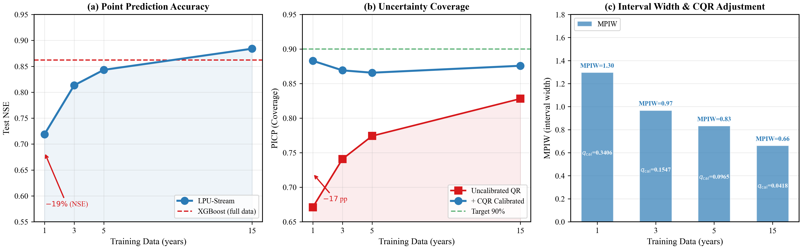
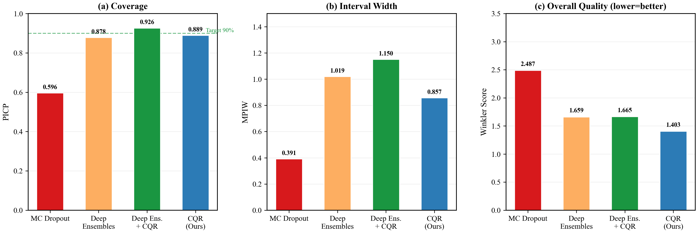

[English](README.md) | [简体中文](README.zh-CN.md)

# 数据稀缺与水文深度学习中的不确定性

论文 **《How Data Scarcity Compromises Uncertainty Estimates in Hydrological
Deep Learning — and How to Fix It with Conformalized Quantile Regression》**
的配套代码。

本项目研究**训练数据量如何影响不确定性估计的可靠性**（而不仅仅是点预测精度）。我们在
CAMELS-US 数据集（671 个流域）上发现：将训练数据从 15 年缩减到 1 年，90% 预测区间的
覆盖率（PICP）从 89% 跌到 72%——远大于同期点预测精度 NSE 的下降（0.844 → 0.665）。我们
诊断了退化机理（区间系统性偏窄、校准曲线变平、流量区间不对称），并证明 **共形分位回归
（CQR）** 仅需一次前向传播、零额外训练成本，即可在所有数据量级别将覆盖率恢复到约 89%。

> **状态：** 水文深度学习中数据稀缺与不确定性研究的代码（论文撰写中）。仓库包含示例结果
> JSON 与图表；24 GB 数据集与模型权重由下列脚本重新生成，不在仓库中。

---

## 核心结果

| 训练数据 | NSE | PICP（未校准） | PICP（CQR） | $q_{\text{cal}}$ | MPIW |
|---|---|---|---|---|---|
| 1 年  | 0.665 | 0.720 | **0.890** | 0.313 | 1.418 |
| 3 年  | 0.788 | 0.809 | **0.894** | 0.105 | 1.059 |
| 5 年  | 0.818 | 0.786 | **0.880** | 0.093 | 1.039 |
| 15 年（671 流域） | 0.844 | 0.889 | **0.889** | 0.001 | 0.857 |

数据稀缺下，**不确定性的退化远比点预测严重**，而 CQR 能稳健地恢复目标覆盖率。

<p align="center">
  <br>
  <em>点预测精度（NSE）下降温和，而区间覆盖率（PICP）骤降；CQR 可将其恢复。</em>
</p>
<p align="center">
  <br>
  <em>MC Dropout、Deep Ensembles、CQR 三者中，只有 CQR 以最窄区间、最优 Winkler 分数达到 90% 目标。</em>
</p>

---

## 安装

```bash
git clone https://github.com/AuroraNeko/data-scarcity-uncertainty-hydrodl.git
cd data-scarcity-uncertainty-hydrodl
pip install -r requirements.txt
```

训练推荐使用 CUDA GPU（论文使用单块 RTX 4090）；分析脚本亦可在 CPU 上运行。测试环境：
Python 3.11、PyTorch 2.11。

## 数据准备（CAMELS-US，约 24 GB）

```bash
# 1. 从 Zenodo 下载原始数据（约 12 GB zip + 属性文件）
python download_camels.py

# 2. 将 zip 解压到 data/raw/camels_us/，再预处理为逐流域 CSV
python src/data/data_preprocessing.py
```

将生成 `data/processed/camels_us/<basin_id>.csv`（671 流域）及 `data/metadata/` 下的归一化
统计量。数据集**不**纳入 git（见 `.gitignore`）。

## 仓库结构

```
.
├── download_camels.py            # 从 Zenodo 获取 CAMELS-US
├── configs/data_config.yaml      # 预处理参考配置（文档说明）
├── src/
│   ├── utils.py                  # 公共工具：get_device()、set_seed()
│   ├── data/                     # data_preprocessing.py、dataset.py（6-tuple 加载）
│   ├── models/                   # lstm、ea_lstm、tcn、transformer、lpu_stream
│   └── losses/                   # pinball_loss、physics_loss、cqr（校准器 + 指标）
├── experiments/
│   ├── baseline/                 # 基线：climatology、persistence、XGBoost、train_model.py
│   ├── scarce/                   # 数据稀缺实验（1/3/5/15 年）
│   ├── uncertainty/              # 分位+CQR、MC Dropout、Deep Ensembles
│   ├── physics_guided/           # 物理约束训练
│   └── analysis/                 # 退化分析 / 跨区域 / 制图 / 统计
├── results/
│   ├── tables/                   # 示例输出 JSON（已提交）
│   └── figures/                  # 生成的图表 PNG + PDF（已提交）
└── docs/
    ├── PAPER_REVISION_NOTES.md   # 论文 ↔ 代码 对照（请阅读）
    └── PROJECT_NOTES_CN.md       # 内部中文项目笔记
```

## 复现实验

流水线顺序为 **预处理 → 训练 → 分析**。训练会把权重写入 `results/checkpoints/`（已 git
忽略），分析脚本会读取它。

```bash
# 点预测基线（LSTM、EA-LSTM、TCN、Transformer、LPU-Stream）
python experiments/baseline/train_model.py --model lpu_stream
python experiments/baseline/train_climatology.py
python experiments/baseline/train_persistence.py
python experiments/baseline/train_xgboost.py

# 主不确定性结果：分位回归 + CQR 校准
python experiments/uncertainty/train_quantile.py        # -> lpu_stream_quantile_best.pt
python experiments/uncertainty/mc_dropout.py            # MC Dropout 基线
python experiments/uncertainty/train_ensembles_fair.py  # Deep Ensembles（5 个 seed）

# 数据稀缺实验（1/3/5/15 年）
python experiments/scarce/train_data_scarce.py --years 1
python experiments/scarce/train_data_scarce.py --years 1 --no-static   # 消融

# 物理约束变体
python experiments/physics_guided/train_physics.py

# 分析与制图（需先训练出上面的 quantile 权重）
python experiments/analysis/analyze_degradation.py
python experiments/analysis/cross_region_validation.py
python experiments/analysis/make_figures.py
```

仓库中 `results/tables/*.json` 与 `results/figures/*` 为这些运行的示例输出。

## 模型 — LPU-Stream

一个轻量循环网络（98,979 参数）：13 个静态流域属性经 MLP（64→32）嵌入为 32 维向量，拼接到
128 单元 LSTM 的每个时间步输入；线性头预测三个分位（0.05 / 0.50 / 0.95），用 pinball loss
训练。CQR 在留出的校准期上做后处理校准。

## 许可证

MIT —— 见 [LICENSE](LICENSE)。
